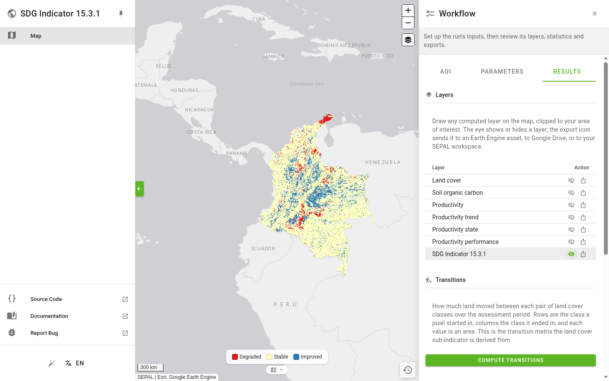

# SDG indicator 15.3.1

[](LICENSE)

## About

This module computes SDG Indicator 15.3.1 — *Proportion of land that is degraded over total
land area* — on Google Earth Engine, from its three sub-indicators: land cover, land
productivity and soil organic carbon.

It follows SDG best practice guidance, in particular the
[UNCCD good practice guidance for SDG 15.3.1](https://prais.unccd.int/sites/default/files/helper_documents/4-GPG_15.3.1_EN.pdf).
The methodology was implemented in consultation with the trends.earth team at Conservation
International.

For a description of the workflow, see the
[SEPAL documentation](https://docs.sepal.io/en/latest/modules/dwn/sdg_indicator.html). Bugs and
questions go on the [issue tracker](https://github.com/sepal-contrib/sdg_15.3.1/issues/new).

## Layout

The module is two packages with one dependency arrow between them.

| Path        | What it is                                                                                                                                                               |
| ----------- | ------------------------------------------------------------------------------------------------------------------------------------------------------------------------ |
| `sdg1531/`  | The domain. Pure Earth Engine graph building, validation and statistics. Imports no widget library and holds no UI state, so every rule in it is testable without a browser. |
| `app/`      | The Solara app: a `MapApp` shell whose right panel edits one `RunSpec` and renders the run's layers, charts and exports.                                                    |
| `component/`| The legacy Voila implementation, kept only as the reference the domain is checked against.                                                                                  |
| `tests/`    | The suites below, including the parity harness.                                                                                                                            |

`app/` imports `sdg1531`. Nothing imports `app/`.

### The domain is a transcription, and the tests enforce that

`sdg1531/` was ported from `component/` **node for node**, warts included: where the legacy
builds an odd graph, so does this, because the two must produce the same numbers. A parity
harness serializes both implementations' Earth Engine graphs and requires them to be
**byte-identical**. Anywhere they may legitimately differ is listed, with its reason, in
`tests/parity/expected_divergences.py` — and a divergence that is not listed there fails the
build. That register, not a reviewer's memory, is what keeps "improving" the domain from
silently changing published results.

If you are changing `sdg1531/`, read `tests/parity/expected_divergences.py` first.

## Running the app

The app needs `pysepal >= 4` and an Earth Engine account. Inside SEPAL both are already there;
locally you need `earthengine authenticate` once.

```bash
git clone https://github.com/sepal-contrib/sdg_15.3.1
cd sdg_15.3.1

micromamba env create -f sepal_environment.yml   # or conda/mamba
micromamba activate sdg_15.3.1

# `[app,dev]`, not `[dev]`: the app extra carries the pysepal>=4 floor that
# sepal_environment.yml's `pysepal<4` pin would otherwise leave in place.
pip install -e ".[app,dev]"

PYSEPAL_LOCAL_EE=1 solara run app/page.py --port 8765
```

`PYSEPAL_LOCAL_EE=1` tells pysepal to use your local Earth Engine credentials instead of looking
for a SEPAL session. Drop it when running inside SEPAL.

<p align="center">
  
</p>

The workflow is three tabs, and each is locked until the one before it is satisfied:

1. **AOI** — choose the area. Everything else stays disabled until this is set.
2. **Parameters** — the assessment period, the productivity sensors and trajectory, the land
   cover source and transition matrix, and the soil organic carbon settings. Problems are
   reported per section as you type; a blocking one keeps **Results** locked.
3. **Results** — draw any of the seven computed layers on the map (the eye), export it to an
   Earth Engine asset, Google Drive or your SEPAL workspace (the export icon), and compute the
   transition matrix, the degradation distribution and zonal statistics.

Editing a parameter or the AOI discards the previous run: its layers come off the map and its
charts and tables are cleared, rather than being left on screen describing a run you have
changed.

## Tests

```bash
pytest                    # the offline suite: domain, app and parity
pytest tests/parity       # the byte-for-byte legacy comparison alone
pytest tests/app          # the Solara app layer alone (needs the `app` extra)
pytest -m network         # deselected by default; these call Earth Engine
ruff check . && ruff format --check . && mypy app sdg1531
```

A bare `pytest` runs everything that does not touch the network — that selection is configured in
`pyproject.toml` so the local command and the CI gate cannot drift apart.

Two things to know before adding tests:

- `tests/app` **skips itself silently** when pysepal 4 is absent, so that a pysepal-3 environment
  can still run the domain suite. Set `SDG_REQUIRE_APP_TESTS=1` to turn that skip into an error.
  CI does.
- In-process renders check the Python render tree; they cannot tell you what a browser paints.
  For that, pysepal's `scripts/browser_probe.mjs` drives headless Chrome over the DevTools
  Protocol. Several defects in this app — a chart that mounted in every test and rendered nothing,
  an icon that did not exist in the shipped font — were only visible from there.

## Contributing

Pull requests are welcome. The CI gate is the four jobs in `.github/workflows/ci.yaml`: the
legacy notebook, the domain suite, the app suite, and ruff + `mypy --strict`. Run the commands
above before opening one.
