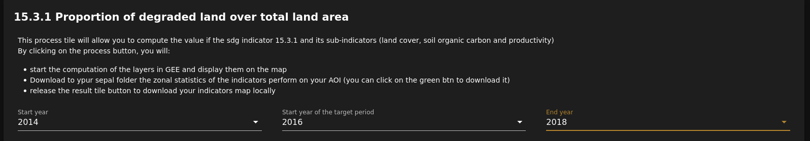
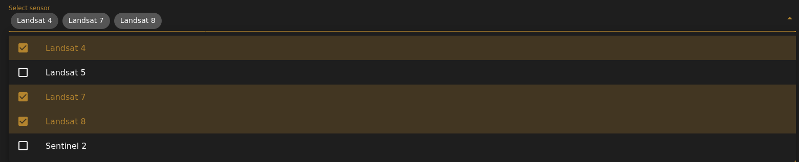
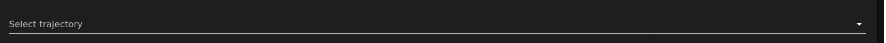
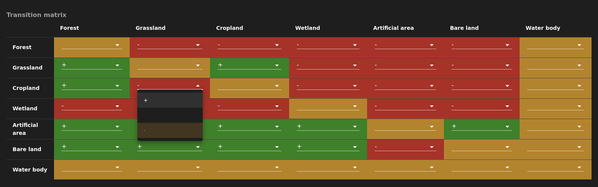
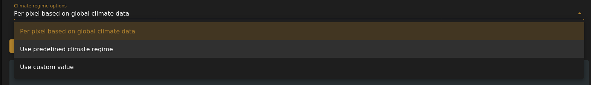
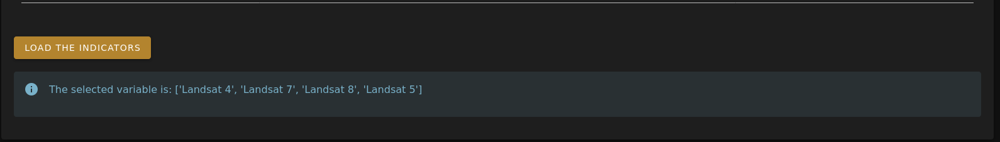

# 2. Calculate SDG indicator 15.3.1

## 2.1 Select Date
Firt you will need to select **start year**, **Start year of the target period (= end yaer of the baseline period)**(= end yaer of the baseline period), and **end year** of the analysis.

## 2.2 Select sensors
Afetr selecting the date all the available sensors within the timeframe will be available. You can deselect or re-select any sensor you want.

## 2.3 Select a trajectory

There are three options available to calculate the productivity trend that describe trajectry of change:
 - Based on NDVI trend
 - Based on residual trend
 - Trend based on water use efficiency

## 2.4 Generate a land cover transition matrix
We need a transition matrix to calculate the degradation that has occurred specifically as a result of land cover change. 
As a transtion is contex specific, you might need to change the transition matrix to suit your objective. You can change the default values just by clicking on a cell.

## 2.5 Select a climate regime

The value of climate resime is required to calculate the SOC change.
You can leave this option to calculate the values using global climate data. Or you can select a predefine value for the entire AOI, or there is also a option avaialble to define a custom value.

Once all the parameters are set you can run the analysis by clicking on the **Load the indicators** button.
It takes time to calulate all the sub-indicator. There is an area that display the current state of analysis just below the **Load the indicators** button.

## 2.6 Download the result
 - The process by default download the zonal statistics in the download folder.
 - To download the results in your local computer, click on the botons available above the map.
 - To download all the Geotif file in the SEPAL folder click on the botton below the map.

[return to &larr; select an AOI](./select_aoi.md)
